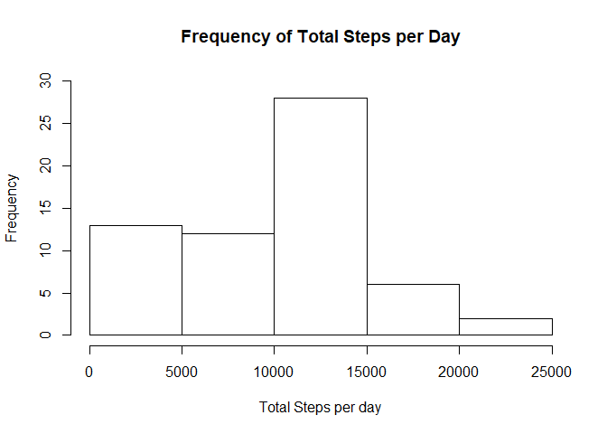
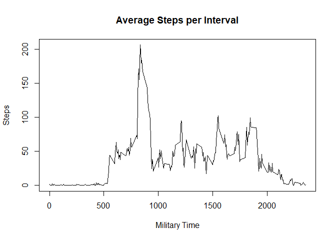
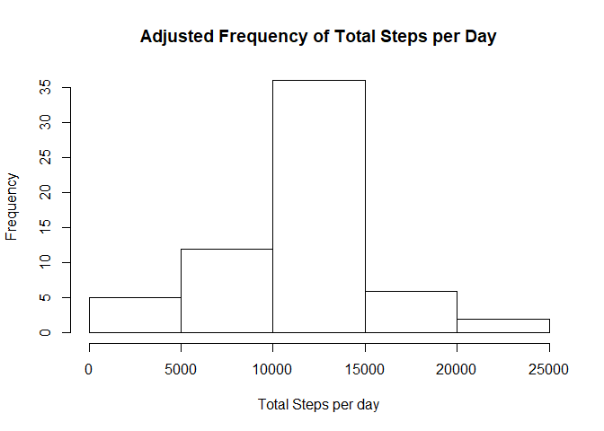
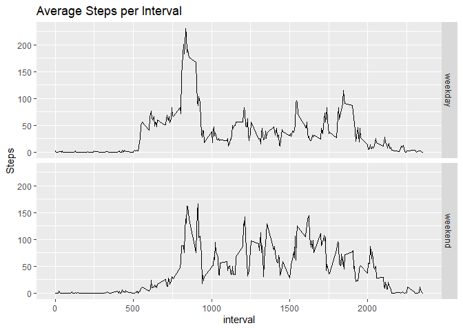

 

```r
library(tidyverse)
```

```
## -- Attaching packages ---------------------------------------------- tidyverse 1.3.0 --
```

```
## v ggplot2 3.3.0     v purrr   0.3.3
## v tibble  3.0.0     v dplyr   0.8.5
## v tidyr   1.0.2     v stringr 1.4.0
## v readr   1.3.1     v forcats 0.5.0
```

```
## -- Conflicts ------------------------------------------------- tidyverse_conflicts() --
## x dplyr::filter() masks stats::filter()
## x dplyr::lag()    masks stats::lag()
```

```r
library(knitr)
library(lubridate)
```

```
## 
## Attaching package: 'lubridate'
```

```
## The following objects are masked from 'package:dplyr':
## 
##     intersect, setdiff, union
```

```
## The following objects are masked from 'package:base':
## 
##     date, intersect, setdiff, union
```
Load required libraries for data analysis and graph display

```r
url <- 'https://d396qusza40orc.cloudfront.net/repdata%2Fdata%2Factivity.zip'
if (!file.exists('repdata_data_activity.zip')) 
    {download.file(url, 'repdata_data_activity.zip')}
#checks if data is downloaded, if not downloads it
if (!file.exists('activity.csv')) {unzip('repdata_data_activity.zip')}
#checks if data is unzipped, if not unzips folder
```

```r
activity <- read.csv('activity.csv')
#reads csv into R
activity$steps <- as.numeric(activity$steps)
#sets step column to numeric values
stepspday <- activity %>% group_by(date) %>% mutate(stepspday = sum(steps,na.rm=TRUE)) %>% ungroup
stepspday <- stepspday[,c(2,4)]
stepspday <- unique(stepspday)
#creates new dataframe with new column for total steps per day
```

```r
hist(stepspday$stepspday , xlab='Total Steps per day' , 
        main='Frequency of Total Steps per Day' , ylim=c(0,30))
```

<!-- -->

```r
#plot of frequency of total steps per day
```


```r
meanstep<-mean(stepspday$stepspday, na.rm=TRUE)
#[3] outputs mean steps per day
medstep<-median(stepspday$stepspday, na.rm=TRUE)
#[3] outputs median steps per day
```

The mean number of steps per day is  **9354.2295082**  

The median number of steps per day is **1.0395\times 10^{4}** (10395, not sure why it is displayed as 10^4)  


```r
stepinterval <- activity %>% arrange(interval) %>% group_by(interval) %>% mutate(stepspint = mean(steps,na.rm=TRUE)) %>% ungroup
#manipulates raw data to include a new column with mean steps grouped by interval
onlystepinterval <- stepinterval[,c(3,4)]
#selects two columns:interval and average steps per interval
onlystepinterval <- unique(onlystepinterval)
#condenses dataframe to remove duplicate values
plot(onlystepinterval$interval,onlystepinterval$stepspint , type='l' , ylab='Steps' , xlab='Military Time' , main='Average Steps per Interval')
```

<!-- -->

```r
#[4] plots average steps per interval (could not get type='l' to work)
```


```r
maxint<-subset(onlystepinterval,stepspint==max(onlystepinterval$stepspint,na.rm=TRUE))
#creates new table with max average steps
maxint[1,1]
#[5] outputs interval value that has the highest step count on average
```
The interval with the maximum average number of steps is **835**, which translates to most steps were taken between 835 to 839 in the morning.  


```r
totalNA<-sum(is.na(activity$steps))
#[6.1] outputs number of NA values
#[6.2] Fill in all NA values with average steps per interval
arrangestep<-arrange(stepinterval,stepinterval$date)
newactivity<-arrangestep
newactivity$steps<-ifelse(is.na(newactivity$steps)==TRUE , newactivity$stepspint , 
                          newactivity$steps)
#[6.3] applys conditional statement if there is a NA value in steps, inputs average 
# step value for that interval
```
The total number of NA values was **2304**. Which is **13.1147541%** of the data. Thats a rather high percentage of data to just remove completely. My strategy for making up for missing data was to input the average steps for each interval for all NA values.

```r
newactivity<-newactivity[,1:3]
newstepspday<-newactivity %>% group_by(date) %>% mutate(stepspday=sum(steps)) %>% ungroup
newstepspday<-newstepspday[,c(2,4)]
newstepspday<-unique(newstepspday)
hist(newstepspday$stepspday , xlab='Total Steps per day' , 
     main='Adjusted Frequency of Total Steps per Day')
```

<!-- -->

```r
#[7] histogram of adjusted data
```

The histogram above has the adjusted data with all NA values replaced with average step per interval.

```r
newmeanstep<-mean(newstepspday$stepspday)
#new mean steps per day
newmedstep<-median(newstepspday$stepspday)
#new median steps per day
#percent error = (exact - experiment)/exact
meanerror<-(mean(stepspday$stepspday,na.rm=TRUE)-mean(newstepspday$stepspday))/(mean(stepspday$stepspday,na.rm=TRUE))*100
#percent error in mean
mederror<-(median(stepspday$stepspday,na.rm=TRUE)-median(newstepspday$stepspday))/(median(stepspday$stepspday,na.rm=TRUE))*100
#percent error in median
#[6.4]
```
I calculated the new mean with the adjusted data, which came out to **1.0766189\times 10^{4}**(10766) and the new median was __1.0766189\times 10^{4}__(10766). Both values increased from the raw data where NA values were removed. I wanted to show the percent error which is calculated by the difference in observed and experimental divided by observed. The mean percent error was **15.0943396%** and the median percent error was **3.5708387%**. I believe the mean and median are the same because I used average (mean) steps per interval not median steps per interval so it would make sense that both numbers would be more closely related to a mean number.    

```r
newactivity$date<-as.Date(newactivity$date)
newactivity<-newactivity %>% mutate(dayOfweek=ifelse((weekdays(newactivity$date)=='Monday' | 
                                                    weekdays(newactivity$date)=='Tuesday' | 
                                                          weekdays(newactivity$date)=='Wednesday' | 
                                                          weekdays(newactivity$date)=='Thursday' | 
                                                          weekdays(newactivity$date)=='Friday') , 
                                                     'weekday','weekend'))
weekday<-subset(newactivity,newactivity$dayOfweek=='weekday')
weekend<-subset(newactivity,newactivity$dayOfweek=='weekend')
weekday<-weekday %>% arrange(interval) %>% group_by(interval) %>% 
            mutate(stepspint=mean(steps)) %>% ungroup
weekend<-weekend %>% arrange(interval) %>% group_by(interval) %>% 
            mutate(stepspint=mean(steps)) %>% ungroup
weekday<-weekday[,3:5]
weekday<-unique(weekday)
weekend<-weekend[,3:5]
weekend<-unique(weekend)
dayall<-rbind(weekday , weekend)
ggplot(dayall , aes(interval , stepspint)) + geom_line() + facet_grid(dayOfweek~.) + 
        labs(y='Steps' , title='Average Steps per Interval')
```

<!-- -->

```r
#[8] Displays graph of average steps per interval for weekdays vs weekends
```

Admittedly, I probably generated the new field weekday vs weekend in the most round about way possible, but I'm confident in its accuracy. The above graphs show the difference in average steps between weekdays and weekends. I defined weekdays as Monday through Friday since most people have to work Fridays. Weekends only included Saturday and Sunday.
